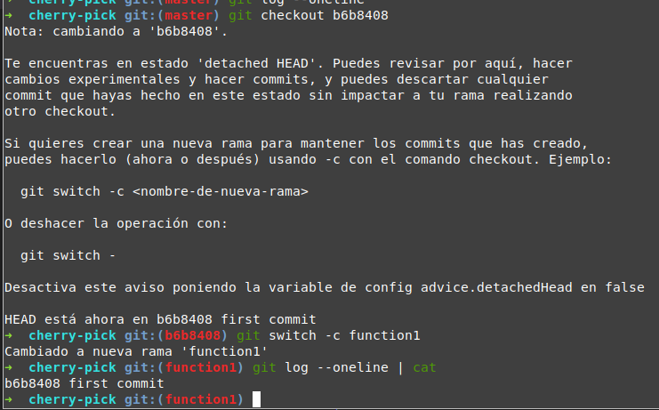
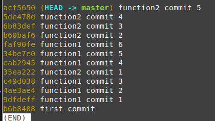
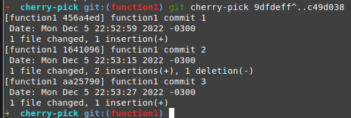
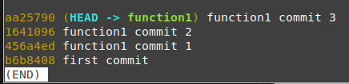
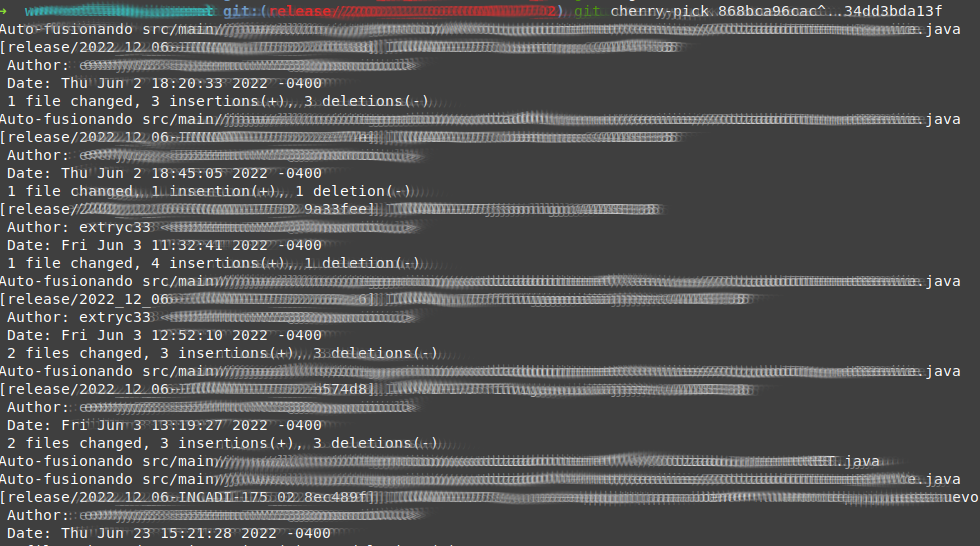
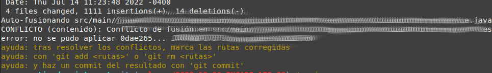
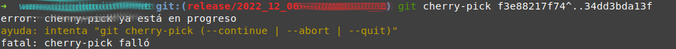
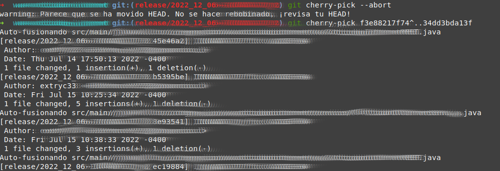

# Conociendo y aplicando con eficiencia Cherry-pick, herramienta peligrosa.

## Contexto
El término "cherry pick", literalmente es la selección de las mejores cerezas, por tanto, coloquialmente se utiliza como seleccionar solo una parte de la totalidad. En nuestro contexto, en un proyecto versionado por git, hacer un 

` $ git cherry-pick <hash>` algo como:
` $ git cherry-pick 780af12866f`

significa, seleccionar solo algunos commit, en vez de todo. 

## Caso de uso
Un caso de uso, es al tener un proyecto con commit de diferentes funcionalidades en la misma rama (esta condición ya nos indica algunas malas prácticas, pero luego comentaré un poco las problemáticas de usar esta herramienta).

En este caso, para "agrupar" todos los commit de 1 funcionalidad en una nueva rama, para ordenar el código y la historia, por ejemplo, se realiza lo siguiente:
1. crear una nueva rama limpia (desde un origen antes de los commit en cuestión)
2. cambiar a esa rama
3. seleccionar cada commit de su funcionalidad con el comando git cherry-pick
4. repetir paso 1, 2 y 3 para cada funcionalidad mezclada
5. [optativa] eliminar la rama mezclada

Si tenemos muchos commit que "pasar", se pueden agrupar los commit para no repetir muchas veces el comando, siempre y cuando estén en la historia secuencialmente. Por ejemplo, si tenemos lo siguiente para
` $ git log --oneline`  

 Tenemos 2 opciones (con variantes) para separar los cambios, pero todas comienzan igual: el paso 1 y 2 se realizan.
1.  ` $ git checkout  b6b8408`
2.  ` $ git switch -c function1`  

Ahora, estando antes de los commit mezclados, hacemos la selección de los commit con cherry-pick, aunque... 

***Atención! el orden importa***
Los commit deben ser seleccionados desde el más antiguo al más reciente

### Opción 1, uno por uno, v1
- ` $ git cherry-pick d43b588`
- ` $ git cherry-pick d43b588`
- ` $ git cherry-pick d43b588`
...  

  

### Opción 1, uno por uno, v2  

` $ git cherry-pick d43b588 d43b588 d43b588 ...`  

### Opción 2, agrupar por montón 
Para agrupar por montón, necesitamos que los commit estén seguidos en la historia original. o sea, si miramos nuevamente el log  

  

podemos realizar 3 agrupamientos, 
1. desde el commit 1 al 3 de la funcion1
2. desde el commit 4 al 6 de la funcion1
3. desde el commit 2 al 4 de la funcion2

para eso, el comando es  

` $ git cherry-pick hash-inicio^..hash-final`  

por ejemplo, para el primer grupo de commit, tenemos lo siguiente:  

***Considerar***
en el comando anterior, el acento circunflejo **^** significa que los hash-inicio y hash-final se agregan. sería posible también hacer:  

- ` $ git cherry-pick hash-inicio..hash-final`  

Y de esta forma, solo se agregaría lo que está entre esos commit, pero no ellos mismos. Tal como en matemática tenemos parentesis abierto o circulo blanco (no incluye) y parentesis cerrado o circulo negro (si incluye). el **^** indica que **si** incluye los commit inicial y final.

## Para considerar seriamente

El uso del cherry-pick está dentro del marco de ocasiones muy especiales, donde no se tienen más opciones o es la más práctica, sin embargo, no es para nada recomendable realizarlo de manera constante. 
Por la naturaleza de los commit, que guardan una copia completa del proyecto, un cherry pick es un commit nuevo que cambia la historia del proyecto. podemos ver que ahora, los hash de los commit con cherry-pick son distintos a los de la rama master:

Además, estos commit fueron cambios simples, hechos para estos ejemplos, pero la vida real es más compleja y la mayoría de las veces que se realizan cherry-pick, el resultado agrega **conflictos**, lo que complica más la operación. 

Por otro lado, si la rama que en el ejemplo se usó como master, no es posible eliminar, quedará siempre con las funcionalidades mezcladas, y será muy complicado "limpiar" o "quitar" esos problemas. O sea, cherry-pick puede solucionar un problema, pero a la vez también aplaza otro. En ocasiones muy especiales es una solución sin consecuencias.

## En caso de conflictos

A veces, necesitamos pasar muchos commit por cherry-pick, y lo más probable es que genere muchos conflictos esta acción. Por tanto, dejo una ayuda para quienes les suceda esto.

Haciendo un cherry-pick con varios commit, como este:

Como se ve, genera conflicto, por lo tanto, no alcanza a pasar todos los commit en 1 línea. 

Tenemos que resolver el conflicto, abriendo nuestro editor de texto, y resolviendo el conflicto. 

Teniendo el conflicto resuelto, tenemos que ver en qué commit quedamos, con 
` $ git log --oneline`

y volvemos a usar 
` $ git cherry-pick hash-inicio^..hash-final`
solo que ahora el "hash-inicial" será un commit intermedio que debemos detectar con el comando anterior.

pero si lo usamos, a veces nos muestra el siguiente mensaje:

Para solucionar este problema, podemos "abortar" el cherry pick que está trabando el cuento...  y lo hacemos con 
` $ git cherry-pick --abort`

y ahora, continuamos con más cherry-pick

Repetimos este proceso cuantas veces sea necesario, para continuar.

